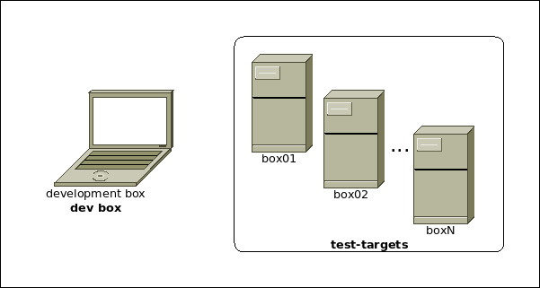

.. _sec-introduction:

==============
 Introduction
==============

A network-connected **development environment**, as illustrated in
:numref:`devenv`, typically consists of a box on which **changes** are created
using editors/IDEs/Toolchains for the task at hand, we refer to such a machine
as the **dev box**.
Said **changes** are then deployed for testing on one or more
boxes/VMs/systems, we refer to the latter as **test-targets**.

With **cijoe** you create an :ref:`sec-config` for each of available
**test-target**.

.. _devenv:

   Development environment containing a **dev box**, and multiple **test-targets**.

The sections :ref:`sec-prerequisites` and :ref:`sec-installation`  describe
what is needed on your **dev box** and your **test-target(s)**.

.. note:: An :ref:`sec-config-example` **environment definition** for a
   **test-target** named ``box01`` is used throughout the documentation, such
   as in the examples of :ref:`sec-running` and dropping into the
   :ref:`sec-shell`.

Once you have ensured that :ref:`sec-prerequisites` are met, have gone through
the :ref:`sec-installation`, and created your :ref:`sec-config`.

.. _GitHUB: https://github.com/refenv/cijoe
